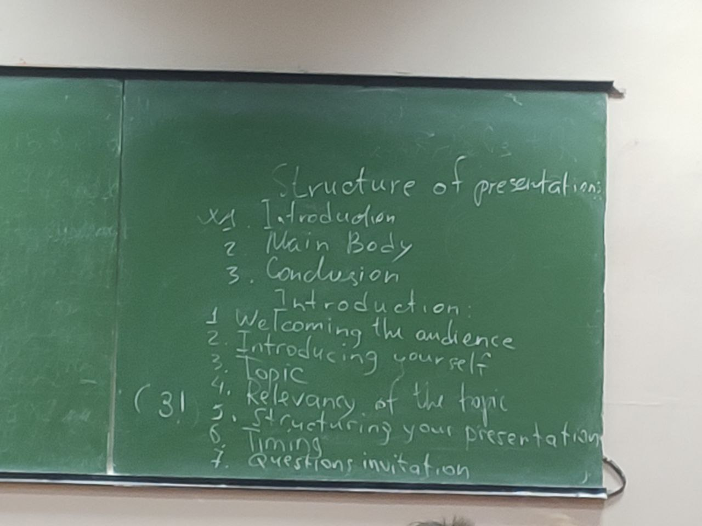

##TASK 1
1. Presentation 1
    1. Don Talor
    2. Head of logistics
    3. Transportition of company
    4. Shelfing system
2. Presentation 2
    1. Sharlotte Best
    2. Team leader
    3. Project documentation
    4. Who involved in project management
3. Presentation 3
    1. Susan Webster
	2. HR manager
	3. In company training and qualification
	4. for department heads

##TASK 2
1. first of all
2. introduce myself
3. present
4. particularly
5. make it, notice
6. screen, topic
7. important, involved
8. aware, schedule
9. probably, human resources manager
10. department heads, I'll need

##TASK 3
* a 3,6
* b 1,5,8
* c 2,9
* d 4,7,10
* b c a d

##TASK 4
orally

##TASK 6

2. showing you how the database works
3. talking about EU tax reform
4. bring you up to date on SEKO's investment plans
5. report on our financial targets for the division
6. update you on the proposed training project
7. looking at business opportunities in Asia
8. begin by telling you about what Jane's group is working on

##TASK 7
1. start
2. then
3. finally
4. divided
5. all
6. after
7. areas
8. third

##TASK 9
###in pairs
1. d
2. f
3. b
4. a
5. c
6. g
7. e
8. i
9. h
10. j

##TASK 11

2. d
3. h
4. g
5. b
6. f
7. a
8. e

TASK IN PAIRS

