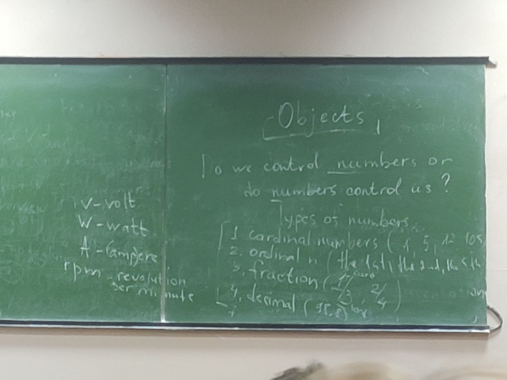

## TASK 1
### speaking

1. 80 euro
2. 15 degrees
3. 13 h
4. 89 C
5. 40 watts
6. 1.2 km
7. 13.8 meters
8. 40.8 meters
9. 190 km per hour
10. 150000 liters
11. 250 revolutions per minute
12. 230V
13. 160kg
14. 2040 watts
15. 1016 kg

## TASK 2
### Exercise 12 from vk screenshot 22 nov
1. barometer -> pressure -> kilopascals -> kPa
2. tachometer -> speed -> kilometers per hour -> km/h
3. odometer -> distance(cycling) -> metres -> m
4. altimeter -> height -> kilometers -> km
5. stop watch -> time -> seconds -> s
6. heart rate monitor -> rate of heart beat -> beatch per second -> bps
7. power monitor -> power output -> watts -> W
8. scales -> weight -> kilograms -> kg